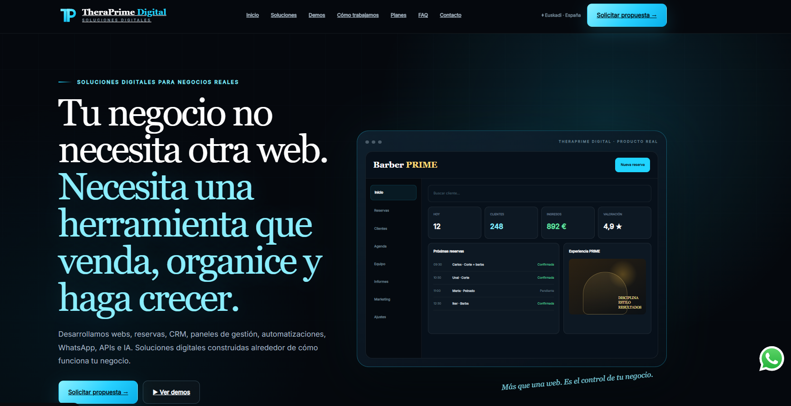
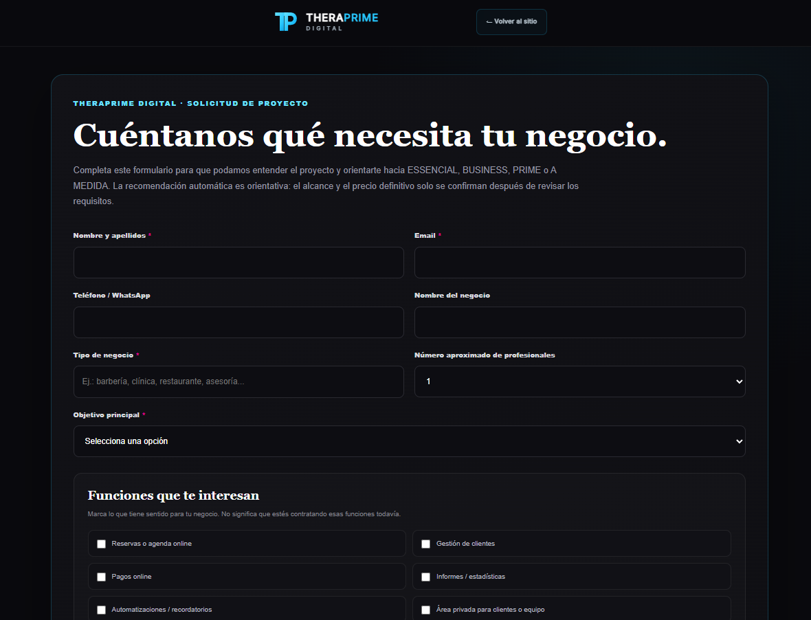
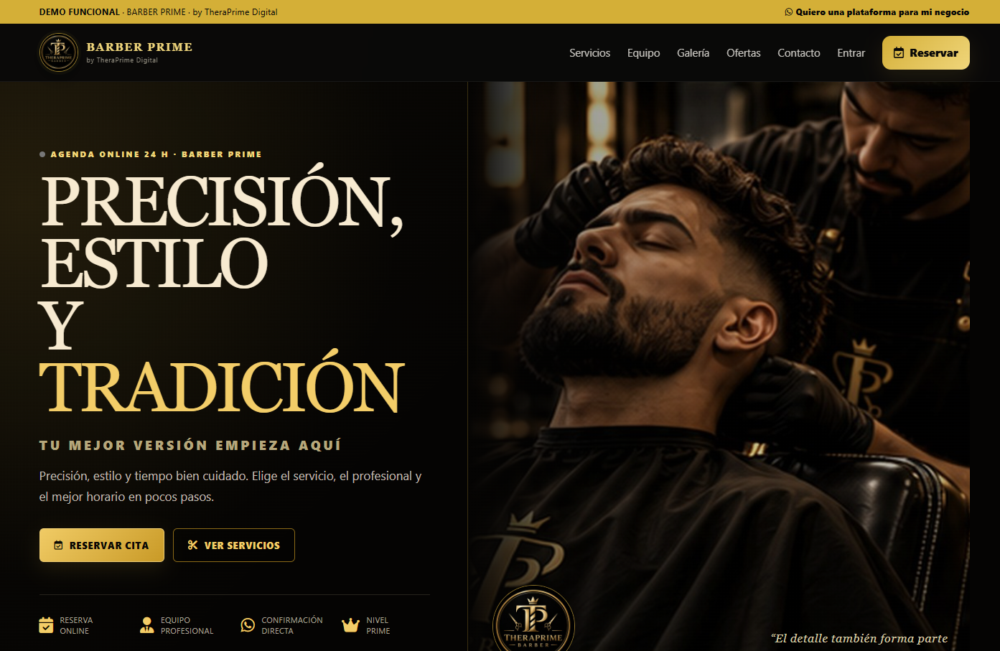
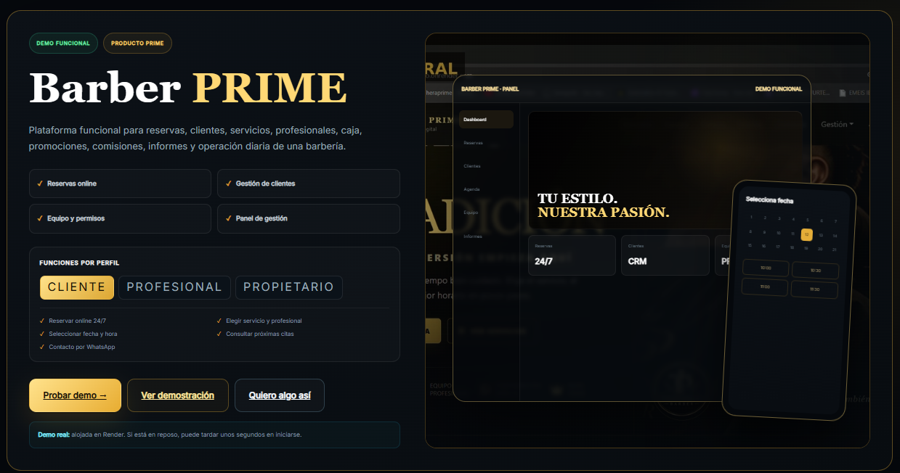

# TheraPrime Digital

> Ecosistema digital para negocios: web, CRM, reservas, automatización y gestión de clientes.

🌐 **Proyecto en producción:** [theraprime.es](https://theraprime.es)

---

## 🚀 TheraPrime Digital en acción

### Plataforma principal

Una plataforma diseñada para convertir una presencia digital en una herramienta real de negocio: captación, reservas, CRM, automatización y gestión.

### Captación estructurada de proyectos

El proceso comercial comienza con una solicitud estructurada que permite entender las necesidades del negocio antes de preparar una propuesta.

### Barber PRIME

Ejemplo de producto vertical desarrollado dentro del ecosistema TheraPrime Digital, orientado a barberías y negocios que trabajan mediante reservas.

### Sistema funcional

Reservas, clientes, profesionales y gestión operativa integrados en una misma solución.

---

## Sobre el proyecto

TheraPrime Digital es un proyecto desarrollado para ir más allá de una página web tradicional.

El objetivo es crear un ecosistema capaz de ayudar a pequeños negocios y profesionales a captar clientes, gestionar oportunidades, organizar procesos comerciales y automatizar tareas.

El proyecto está orientado principalmente al mercado español, con especial enfoque en negocios locales.

---

## Qué incluye el ecosistema

### 🌐 Web profesional

Sitio corporativo diseñado para presentar servicios, captar clientes potenciales y dirigirlos hacia un proceso comercial estructurado.

### 👥 CRM propio

Sistema personalizado de gestión de leads y clientes con seguimiento de diferentes etapas del proyecto:

`Lead → Briefing → Propuesta → Contrato → Pago → Desarrollo → Revisión → Entrega`

### 📅 Reservas

Integración de sistemas de reserva para negocios que trabajan mediante citas.

### ⚙️ Automatización

Procesos diseñados para reducir tareas manuales y mejorar el seguimiento de clientes.

### 📂 Archive Sync

Sistema desarrollado para sincronizar eventos importantes del CRM con un archivo empresarial estructurado y seguro.

Ejemplos de eventos:

- creación de lead
- recepción de briefing
- propuesta enviada
- contrato firmado
- pagos
- entrega del proyecto
- mantenimiento

### 💳 Integraciones de pago

Arquitectura preparada para integrar métodos como:

- PayPal
- transferencia bancaria
- Bizum
- pagos recurrentes de mantenimiento

---

## Barber PRIME

Dentro del ecosistema TheraPrime también se desarrollan soluciones verticales.

**Barber PRIME** es un ejemplo orientado a barberías, con funcionalidades como:

- reservas
- gestión de servicios
- empleados
- disponibilidad
- clientes
- administración del negocio

La misma arquitectura puede adaptarse a otros sectores.

---

## Sectores objetivo

TheraPrime Digital puede adaptarse a negocios como:

- Barberías
- Restaurantes
- Clínicas
- Centros de estética
- Profesionales sanitarios
- Abogados
- Pet care
- Servicios locales
- Autónomos y pequeñas empresas

---

## Tecnologías utilizadas

El ecosistema utiliza diferentes tecnologías según las necesidades de cada módulo:

- WordPress
- PHP
- JavaScript
- HTML / CSS
- Python
- Flask
- Node.js
- PostgreSQL
- REST APIs
- Webhooks
- GitHub
- Render
- Hostinger

---

## Filosofía del proyecto

No se trata simplemente de crear páginas web.

El objetivo es construir sistemas digitales que puedan convertirse en parte de la operación diaria de un negocio.

> **No creamos solo páginas web. Creamos sistemas digitales para hacer crecer negocios.**

---

## Seguridad y privacidad

Este repositorio funciona como **case study y showcase público**.

Por razones de seguridad y privacidad no se publican:

- credenciales
- API secrets
- tokens
- datos reales de clientes
- contratos
- configuraciones privadas
- bases de datos
- código interno sensible
- backups de producción

---

## Estado

🚧 Proyecto en evolución continua.

Actualmente se siguen desarrollando nuevas automatizaciones, integraciones y productos dentro del ecosistema TheraPrime.

---

## ¿Quieres algo parecido para tu negocio?

Si tienes un negocio y quieres digitalizar reservas, clientes, procesos o automatizaciones:

🌐 [theraprime.es](https://theraprime.es)

📍 España

**Solicita una demo.**
